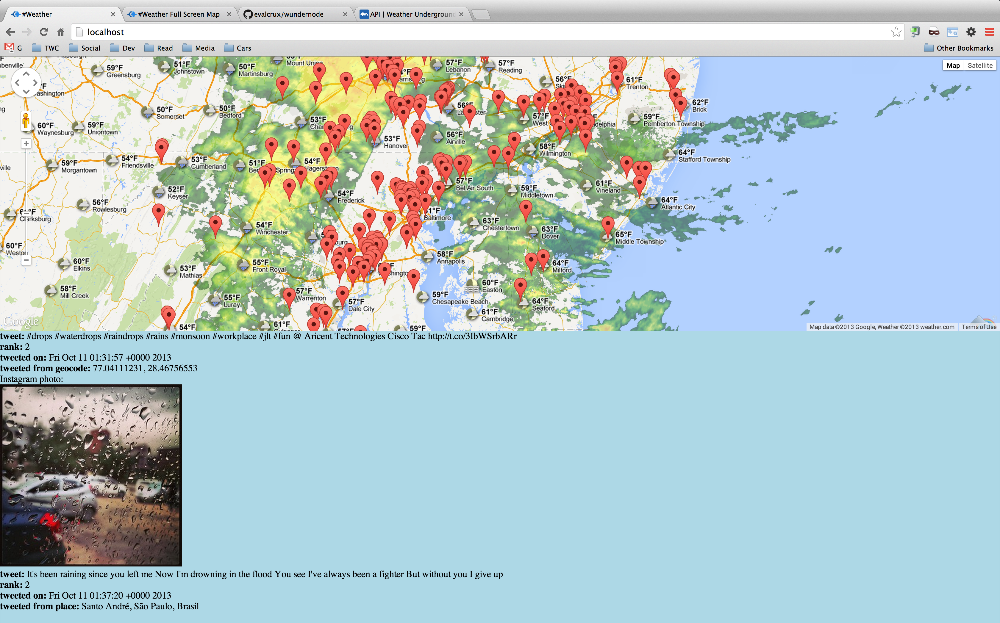

Twitter-Weather-Map-Study
=========================

A twitter, weather (wunderground), and google maps mashup

This was written in two nights for The Weather Channel Companies Hackathon 2013 as a proof of concept that twitter (and eventually other social media) could be a viable source of real-time data for weather events.  Rain-start-stop was one of paticular interest, however the team discovered several other events such as the typhoon in the Philippines the night before their demo to TWCC and a rainy protest near Washington D.C. in a valley where radar was missing.

Excuse our mess, we've not been able to take the time to refine logic or perform any kind of cleanup.  This was written as a POC.

Example of output:

